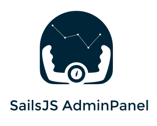

<p align="center">

</p>


<span class="badge-npmversion"><a href="https://npmjs.org/package/sails-adminpanel" title="View this project on NPM"></a></span>


Autogeniration adminpanel |  internationalization | User & Group access rights | Policies | Modern UI

In nearest future: Customization dashboard | Custom widgets | Wizards

### ***sails-adminpanel readme for sails v1.x***

___sails v0.x is not supported___

TODO:
1. Check csrf to fileUpload
2. Docs finish
3. Add disabled fields to all widgets

for fileUploader

    csrf: false


# Installation

To install this hook you will need to run:

    npm install sails-adminpanel

> Currently, we have to patch sails framework, so you install our patches for using
all functionality. Without these patches i18n will not work. [Read how to install patch](https://www.npmjs.com/package/dark-sails)

Then you will need to create a config file for admin panel generator into `config/adminpanel.js`

This is example of this file:

    'use strict';

    module.exports.adminpanel = {
        models: {

            pages: {

                title: 'Pages',
                model: 'Page',

                list: {
                    fields: {
                        id: 'ID',
                        name: 'Article name'
                    }
                },

                edit: {
                    fields: {
                        name: 'Article name',
                        content: {
                            type: 'wysiwyg',
                            title: 'Article body'
                        }
                    }
                }
            }
        }
    };


And your admin panel will be accessible under: `http://127.0.0.1:port/admin`

## Gulp
***Main gulp file*** -- `gulpfile.js`
### Gulp commands
`gulp` -- development mode

`gulp prod` -- production mode

## CKeditor5
**Custom build file** -- `assets/src/scripts/ckeditor5/app.js`
**gulp task** -- `gulp ckeditorBuild`

## Migrations
```javascript
if ((process.env.NODE_ENV === "production" && process.env.DATASTORE === "postgres") || process.env.ADMINPANEL_MIGRATIONS_FORCE === "TRUE")  {
    if (process.env.ADMINPANEL_MIGRATIONS_SKIP !== "TRUE") {
        await MigrationsHelper.addToProcessMigrationsQueue(`${sails.config.adminpanel.rootPath}/migrations`, "up");
    }
}
```

Adminpanel migrations will run if some conditions will be done.
Set `process.env.NODE_ENV = "production"` and `process.env.DATASTORE = "postgres"`
or use `process.env.ADMINPANEL_MIGRATIONS_FORCE = "TRUE"`. But if you want to forbid
migrations and cancel all these conditions use `process.env.ADMINPANEL_MIGRATIONS_SKIP = "TRUE"`

## Documentation

Take a look into [docs](https://github.com/sails-adminpanel/sails-adminpanel/tree/master/docs) folder. There are a lot of docs about configuration and usage.

## UI reference

We use VmWare Clarity framework as UI framework

Clarity docs https://vmware.github.io/clarity/documentation/v0.13/

for build styles - sass --watch clarity/src:assets/styles/

# JSON-schema config

`npx ts-json-schema-generator -p ./interfaces/adminpanelConfig.d.ts > adminpanel-config.schema.json`

## License

MIT
